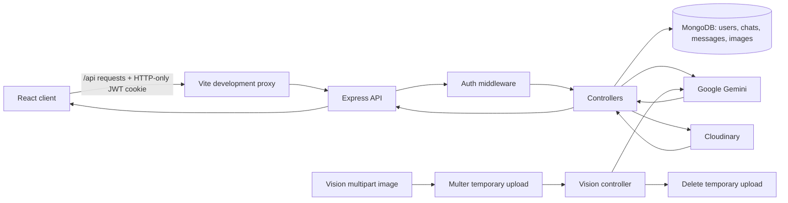

# WiinAI

WiinAI is a full-stack AI workspace with authenticated conversations, AI image generation, and image analysis. The React client talks to an Express API; the API persists user data and chat history in MongoDB and uses Google Gemini for AI responses.

## Capabilities

- Account signup, login, logout, and cookie-based JWT sessions.
- Persistent chat conversations and message history per user.
- Gemini text responses with model fallback and retry handling for transient failures.
- Gemini image generation, with generated images stored in Cloudinary.
- Vision analysis: upload an image and ask Gemini to describe or answer questions about it.
- Responsive React/Vite dashboard with chat, history, image, settings, and vision pages.

## Prerequisites

- Node.js 20 or later.
- A MongoDB Atlas database (or another reachable MongoDB deployment).
- A Gemini API key from [Google AI Studio](https://aistudio.google.com/apikey).
- A Cloudinary account for image generation.

## Installation

```bash
git clone <your-repository-url>
cd "My Own App"

cd backend
npm install

cd ../client
npm install
```

The backend includes its required dependencies, including `cors` and `multer`; always run `npm install` from the `backend` directory after pulling changes.

## API-key and environment setup

Create `backend/.env`. Never commit this file or paste its values into the client.

```env
PORT=3000
CLIENT_URL=http://localhost:5173
NODE_ENV=development

MONGODB_URI=mongodb+srv://<username>:<password>@<cluster-host>/<database>?retryWrites=true&w=majority
JWT_SECRET=<a-long-random-secret>

GEMINI_API_KEY=<your-google-ai-studio-key>
# Optional model overrides
GEMINI_MODEL=gemini-2.5-flash
GEMINI_IMAGE_MODEL=gemini-2.0-flash-preview-image-generation

CLOUDINARY_CLOUD_NAME=<cloud-name>
CLOUDINARY_API_KEY=<api-key>
CLOUDINARY_API_SECRET=<api-secret>
```

If startup reports `querySrv ENOTFOUND`, the host in `MONGODB_URI` is invalid, deleted, or otherwise not publicly resolvable. Copy a fresh **Drivers / Node.js** connection string from the correct Atlas cluster, replace `MONGODB_URI`, and restart the API.

## Usage

Run the API and client in separate terminals:

```bash
cd backend
npm run dev
```

```bash
cd client
npm run dev
```

Open the Vite URL (normally `http://localhost:5173`), create an account, and use the dashboard:

1. **New Chat** starts or continues a saved conversation.
2. **History** loads prior conversations.
3. **Generate Image** creates an image from a prompt and stores it in Cloudinary.
4. **Vision Service** accepts an image plus an optional question and returns Gemini's analysis.

In development, Vite proxies `/api` to `http://localhost:3000`, so browser requests should use relative API paths such as `/api/chat`.

## API overview

Authenticated endpoints require the `jwt` HTTP-only cookie set by signup or login.

| Area | Endpoint | Purpose |
| --- | --- | --- |
| Auth | `POST /api/auth/signup` | Create an account |
| Auth | `POST /api/auth/login` | Start a session |
| Auth | `POST /api/auth/logout` | End a session |
| Auth | `GET /api/auth/checkAuth` | Retrieve the current session |
| Chat | `POST /api/chat` | Send a message; optional `chatId` continues a chat |
| Chat | `GET /api/chat` | List the signed-in user's chats |
| Chat | `GET /api/chat/:chatId` | Get a chat's messages |
| Images | `POST /api/image` | Generate and store an image from `{ "prompt": "..." }` |
| Vision | `POST /api/vision` | Analyze multipart field `image` and optional field `prompt` |

## Architecture

- `client/` — React 19, Vite, Tailwind, Zustand, React Router, and UI components.
- `backend/src/index.js` — Express application, middleware, route mounting, and MongoDB startup.
- `backend/src/routes/` — HTTP route definitions.
- `backend/src/controller/` — request validation, auth checks, persistence, and response handling.
- `backend/src/services/` — Gemini text/image/vision integrations.
- `backend/src/models/` — Mongoose models for users, chats, messages, and generated images.
- `backend/src/utils/` — JWT protection, cookie generation, and Multer upload handling.

### Backend data flow



## Safe calculator details

A calculator tool is **not currently implemented** in this repository. If you add one for AI tool use, do not evaluate model-provided expressions with `eval`, `Function`, shell commands, or arbitrary code execution.

Use a small allow-listed expression parser instead:

- Permit only numeric literals, parentheses, whitespace, and `+`, `-`, `*`, `/`, and optionally `**`.
- Reject identifiers, property access, brackets, quotes, commas, assignments, and excessively long expressions before parsing.
- Parse into an AST using a maintained math-expression parser or a deliberately limited parser; then evaluate only supported AST node types.
- Enforce input-length, nesting-depth, and execution-time limits; explicitly reject division by zero and non-finite results.
- Return structured values such as `{ expression, result }`, not executable text.
- Keep tool invocation server-side and validate all tool arguments independently of Gemini output.

This approach gives the model reliable arithmetic without granting it access to Node.js, the filesystem, environment variables, or the network.

## Testing and verification

Current scripts:

```bash
cd client
npm run lint
npm run build
```

The backend currently has no automated test runner configured. Before deployment, add endpoint tests for authentication, ownership checks on chats, Gemini error mapping, multipart vision uploads, temporary-file cleanup, and calculator parser limits if that tool is added.

For a quick manual backend check, start the server and confirm it logs both a MongoDB connection and its listening port. A failed MongoDB connection prevents the server from listening by design.

## Adding a new AI tool

1. Define an explicit request schema and a narrow JSON response schema.
2. Add a service in `backend/src/services/` that performs only the intended operation.
3. Add a controller that validates input, checks authentication/ownership, calls the service, and maps errors without leaking secrets.
4. Mount a protected route in `backend/src/routes/` and `backend/src/index.js`.
5. Add a client page or action that calls the route using a relative `/api/...` URL.
6. Add tests for valid input, invalid input, unauthenticated requests, authorization boundaries, provider failures, and cleanup.

Treat every AI-generated tool argument as untrusted input. Keep credentials in `backend/.env`, use least-privilege provider keys, and put rate limits and size limits around expensive endpoints.
